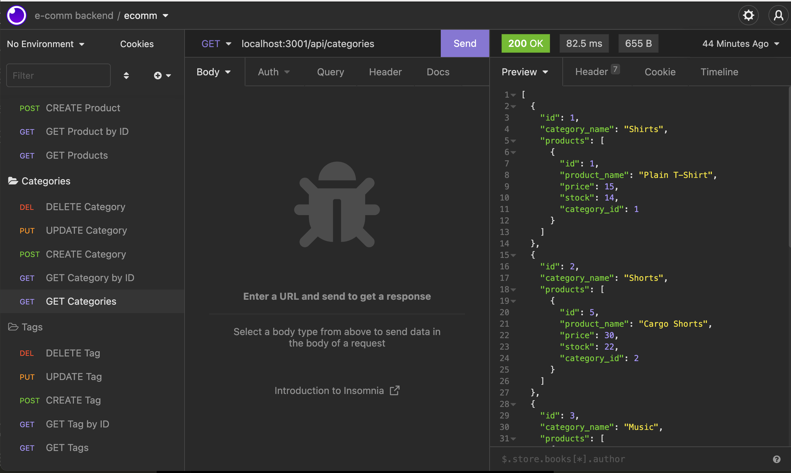

# E-Commerce Backend


A back-end server and database for an ecommerce website. This application uses an Express.js API and Sequelize to interact with a mySQL database to allow you to view, edit, and delete data for management of your e-commerce products. 

## Table of Contents
-[Installation](#installation) 

-[Usage](#usage)

-[Demo](#demo)

-[Questions](#questions)

-[License](#License)

## Installation
To use this application, you must install the required dependencies using the package.json file. To install, please make sure you have node.js installed and run the following code snippet in your command line:

```md
npm install package.json
```

## Usage 
To use this application, first clone this repository and create a `.env` file using the format in the provided `.envEXAMPLE` file, using your mySQL credentials. You may also edit `seeds.sql` with your product data, or POST it to the server using Insomnia.

Then, log into mySQL on your command line and run the following code:

```md
source /db/schema.sql;
```
Next, exit mySQL and, if you decided to create a seed file, run the following code snippet:

```md
node run seed
```

Finally, run the following command to start the server: 

```md
nodemon server.js
```

Once the server is started, you may use Insomnia, Postman or another similar application to make GET, POST, PUT, and DELETE requests to the server.

## Demo
Below is a short demo of how to create and seed your database:


You can find a walkthrough video of all GET, POST, PUT, and DELETE requests using Insomnia [HERE](https://drive.google.com/file/d/1Xm8TogMgEwuKc5YXjWDu00336DiJDKc2/view).



## Questions 
For more information and to see more of my work, please visit my [GitHub](https://github.com/maiavelli/).

For any additional questions or general inquiries, you can contact me at maiacamilledavis@gmail.com.

## License
Copyright (c) `2022`, `Maia Davis`

Permission to use, copy, modify, and/or distribute this software for any purpose with or without fee is hereby granted, provided that the above copyright notice and this permission notice appear in all copies.

THE SOFTWARE IS PROVIDED "AS IS" AND THE AUTHOR DISCLAIMS ALL WARRANTIES WITH REGARD TO THIS SOFTWARE INCLUDING ALL IMPLIED WARRANTIES OF MERCHANTABILITY AND FITNESS. IN NO EVENT SHALL THE AUTHOR BE LIABLE FOR ANY SPECIAL, DIRECT, INDIRECT, OR CONSEQUENTIAL DAMAGES OR ANY DAMAGES WHATSOEVER RESULTING FROM LOSS OF USE, DATA OR PROFITS, WHETHER IN AN ACTION OF CONTRACT, NEGLIGENCE OR OTHER TORTIOUS ACTION, ARISING OUT OF OR IN CONNECTION WITH THE USE OR PERFORMANCE OF THIS SOFTWARE.
